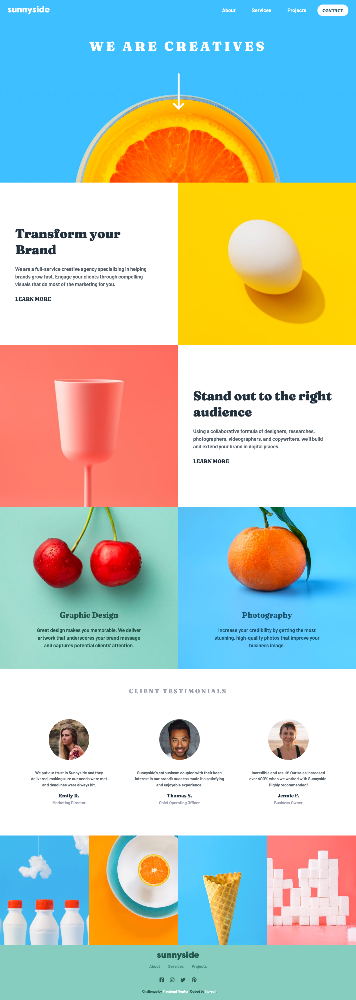

# Frontend Mentor - Sunnyside agency landing page solution

This is a solution to the [Sunnyside agency landing page challenge on Frontend Mentor](https://www.frontendmentor.io/challenges/sunnyside-agency-landing-page-7yVs3B6ef). Frontend Mentor challenges help you improve your coding skills by building realistic projects.

## Table of contents

- [Overview](#overview)
  - [The challenge](#the-challenge)
  - [Screenshot](#screenshot)
  - [Links](#links)
- [My process](#my-process)
  - [Built with](#built-with)
  - [Useful resources](#useful-resources)
- [Author](#author)

## Overview

### The challenge

Users should be able to:

- View the optimal layout for the site depending on their device's screen size
- See hover states for all interactive elements on the page

### Screenshot

### Links

- Solution URL: [Github](https://github.com/flp-pcll/sunnyside-agency-landing-page)
- Live Site URL: [Sunnyside Agency Landing Page Solution](https://flp-pcll.github.io/sunnyside-agency-landing-page/)

## My process

### Built with

- Semantic HTML5 markup
- CSS custom properties
- Flexbox
- CSS Grid
- Javascript

### Useful resources

- [A Tale of Two Viewports - Part One](https://www.quirksmode.org/mobile/viewports.html)
- [A Tale of Two Viewports - Part Two](https://www.quirksmode.org/mobile/viewports2.html)

- [Using the viewport meta tag to control layout on mobile browsers - MDN Web Docs](https://developer.mozilla.org/en-US/docs/Web/HTML/Viewport_meta_tag) - 

## Author

- Website - [Felipe Pacelli](https://github.com/flp-pcll)
- Frontend Mentor - [@flp-pcll](https://www.frontendmentor.io/profile/flp-pcll)

